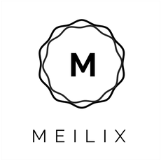

<p align="center">
    
</p><br><br>

# Meilix

[](https://gitter.im/fossasia/meilix?utm_source=badge&utm_medium=badge&utm_campaign=pr-badge&utm_content=badge) [](https://travis-ci.org/fossasia/meilix)

 
A beautiful and customizabsle Linux build for out of the box features for any event. You can use the Meilix Generator (Web app) to make a Linux for your own brand/event, also add apps and features you need pre-installed, it will create an ISO Image of your Linux, which you can use for live boot or as you want. 

`Meilix is under heavy development`

# Index

1. [Introduction](#introduction)
    1. [Features](#feature)
    2. [Architecture](#architecture)
    3. [Ecosystem](#ecosystem)
2. [Usage](#usage)
3. [Pre Requisites](#pre-requisites)
4. [Development](#development) 
    1. [File Structure](#file-structure)
    2. [Build](#build)
    3. [Metapackages](#metapackages)
5. [Contribution](#contribution)
    1. [Community](#community)
    2. [Guideline](#guideline) 
    3. [Workflow](#workflow)
    4. [Best Practice](#best-practice)
6. [Resource](#resource) 
7. [Gallery](#gallery)
8. [License](#license)

## Introduction

This project serves as a solution for those who wish to have a pre-configured custom Linux, with all the needed apps/features already installed. An example of its use case is events. Every event organizer needs to have all their systems configured equally, and need some specific apps to run the event. Configuring each system one by one can be a time taking and difficult task, but using Meilix, they can create their own custom Linux ISO and run/live boot on as many systems as they want. It will not just save countless hours, but also make the process more cost-efficient. 

### Feature

Meilix is a light weight, beautiful and fast Linux with all the features of Ubuntu/Debian distro. Following are some of the other features that Meilix offers:

- You can brand your Linux as you want. Your company name and logo can be your:
    - Linux name
    - Linux logo
    - Wallpaper
    - Screensaver

- Switch on/off various features of your linux. You can switch: 
    - 64 Bit support (32 Bit is default)
    - Notifications
    - Screensaver
    - Sleep Modes 
    - System Sounds
    - Bookmarks
    - Screen Dimming
    - Power Management Saving 
    - Taskbar Autohide

- Following apps can be pre-installed in your linux: 
    - Chromium
	  - Firefox
	  - Hangout
	  - VLC
	  - GIMP
	  - Inkscape
	  - LibreOffice
	  - Git
	  - NextCloud
	  - Dropbox

- Add all the documents and files your need in your linux.
- System Lock: it allows you to freeze all the systems your are hosting using Meilix. 


### Architecture

Meilix is based on Ubuntu/Debian architecture, using LXQT as the standard DE(Desktop Environment).

### Ecosystem

Following are the other projects/dependency part of Meilix ecosystem.

Name | About | 
-------------|-------|
[Meilix-generator](https://github.com/fossasia/meilix-generator) | A webapp which generates an ISO Image of Meilix Linux
[Meilix-systemlock](https://github.com/fossasia/meilix-systemlock/) | A program to freeze the system 
[Meilix-artwork](https://github.com/fossasia/meilix-artwork/) | Repository to store all assets of Meilix

## Usage

To create your own Linux for an event or just for trying it out, you can use [Meilix-generator](https://github.com/fossasia/meilix-generator). A web app, which has all the options to customize and generate an ISO. 

## Pre Requisites

Here are some pre-requisites to develop Meilix. 

- Exposure to the terminal and basic commands. 
- Experience in working with a UNIX or GNU/Linux based system. 
- Basic understanding of Operating System and Package managers. 
- Programming/Scripting experience. Python, Shell Scripting etc.

## Development 

Meilix fetch ubuntu source, customize it to add features and then build the distro. It use shell scripts to perform all the tasks, build can be made on local machine, Trvis CI or Circle CI.

### File Structure

Basic understanding of the file structure is required to do development, here is a level 2 file structure of this project

```console
.
├── build.sh
├── LICENSE.md
├── logo.png
├── sources.list
├── README.md
├── meilix-metapackage_1.0-1_amd64.changes
├── plymouth-meilix-logo_1.0-1_all.deb
├── plymouth-meilix-text_1.0-1_all.deb
├── meilix-metapackage_1.0-1_all.deb
├── meilix-metapackages_1.0_all.deb
├── meilix-metapackage_1.0-1.tar.gz
├── meilix-metapackage_1.0-1.dsc
├── systemlock_0.1-1_all.deb
├── image-amd64.tar.lzma
├── image-i386.tar.lzma
├── amd64.tar.lzma
├── meilix-metapackages_1.0_all
│   └── control/...
├── ubiquity-slideshow
|   └── slides/...
├── metapackage
│   └── debian/...
├── polkit-1
│   └── actions/...
├── dists
│   └── trusty/...
├── conf
│   └── distributions/...
├── pool
│   └── main/...
├── mail-scripts
│   ├── mail-fail.py
│   └── mail.py
├── meilix-artwork
│   ├── debian/...
│   ├── Makefile/...
│   └── usr/...
├── systemlock-0.1
│   ├── debian/...
│   ├── etc/...
│   ├── Makefile/...
│   └── usr/...
├── meilix-default-settings
│   ├── debian/...
│   ├── etc/...
│   ├── Makefile/...
│   └── usr/...
├── db
│   ├── checksums.db
│   ├── contents.cache.db
│   ├── packages.db
│   ├── references.db
│   ├── release.caches.db
│   └── version
├── image
│   ├── boot/...
│   ├── casper/...
│   ├── dists/...
│   ├── EFI/...
│   ├── install/...
│   ├── isolinux/...
│   ├── pics/...
│   ├── pool/...
│   └── preseed/...
├── scripts
│   ├── aptRepoUpdater.sh
│   ├── arch.sh
│   ├── browser_uri.sh
│   ├── chroot.sh
│   ├── debuild.sh
│   ├── legacy_initrdext.sh
│   ├── mail-fail.py
│   ├── mail.py
│   ├── meilix_check.sh
│   ├── mew.sh
│   ├── packages
│   └── releases_maintainer.sh
└──chroot
    ├── bin/...
    ├── boot/...
    ├── dev/...
    ├── etc/...
    ├── home/...
    ├── lib/...
    ├── lib64/...
    ├── media/...
    ├── mnt/...
    ├── opt/...
    ├── proc/...
    ├── root/...
    ├── run/...
    ├── sbin/...
    ├── srv/...
    ├── sys/...
    ├── tmp/...
    ├── usr/...
    └── var/...
```


### Build

**Building Locally**

1. Make the build script executable.

```console
$ chmod +x ./build.sh
```

2. Execute the script.

```console
$ ./build.sh
```

**Build Using Travis***

1. Update `.travis.yml` according to your API. [Read More](https://blog.fossasia.org/setting-environment-variables-up-in-travis-and-heroku-for-meilix-and-meilix-generator/)
2. Push changes to your repo, it will start the build process.

### Metapackages

**Creating a metapackage**

Creating a metapackage is really easy, we will make use of [equivs](http://apt.ubuntu.com/p/equivs) to make our metapackage.
- First, install equivs: `sudo apt-get install equivs`
- Now run equivs: `equivs-control ns-control`
- It will create a file called ns-control, open this file with your text editor.
- Modify the file to your needs modifying the needy information.
- Then run: `equivs-build ns-control` to build your metapackage, thats all simple and easy.
- To add it to meilix follow adding a metapackage to meilix section.

**List of basic items included while creating a metapackage**

- Changes will be made in the ns-control file which was created earlier.
- Change the name of the ns-control file to control.
- There are several lines of which required one are mention below:
- Source and package is the name of the metapackage that we want to give.
- Depends line consists of the packages that we want the metapackage should consistes of.
- Description line consists a short description of the metapackages.
- There are lots of other line which also matters depending upon the need of the metapackage. Go through [here](https://www.debian.org/doc/manuals/maint-guide/dreq) for more info.

**Adding a Metapackage to meilix**
- Create a metapackage and place it in the root directory of the project
- Add it to the build.sh file like `sudo cp -v nameOfYourMeta-package.deb chroot` in the 'copy source.list' line and `dpkg -i nameOfYourMeta-package.deb` lastly `apt-get install -f`.
- Follow the syntax (writing style) used in the build.sh
- Install `reprepro` if you don't have it, run: `sudo apt-get install reprepro`
- Make sure you are on the meilix repository.
- Run the following command for each meta-package you create: `reprepro includedeb trusty ./nameOfYourMeta-package.deb`

**Personalizing it**
Updating the OS/metapackage to the latest version
- For this, we need to update sources.list file to the version we desire.

## Contribution

Your contributions are always welcome and appreciated. To keep your experience good, we suggest you read all the guidelines thoroughly, also take some time to understand the workflow for this project. Each contribution is expected to follow best practices and community guidelines. Following are the things you can do to contribute to Meilix

1. **Report a bug** <br>
If you think you have encountered a bug, and we should know about it, feel free to report it [here](https://github.com/fossasia/meilix/issues/new) and our community will take care of it.

2. **Request a feature** <br>
You can also request for a feature [here](https://github.com/fossasia/meilix/issues/new), and if the community feels it's viable, it will be picked for development.  

3. **Create a pull request** <br>
It can't get better then this, your pull request will be really appreciated by the community. You can get started by picking up any open issues from [here](https://github.com/fossasia/meilix/issues) and make a pull request.

> If you are new to open-source, make sure to check read more about it [here](https://www.digitalocean.com/community/tutorial_series/an-introduction-to-open-source) and learn more about creating a pull request [here](https://www.digitalocean.com/community/tutorials/how-to-create-a-pull-request-on-github). 

### Community 

Meilix have contributor around the world,  constantly improving Meilix and helping others as well to do so. To get in touch with the community, you can use the following communications channels. 

**Gitter**: [https://gitter.im/fossasia/meilix](https://gitter.im/fossasia/meilix) <br>
**Slack**: [http://fossasia-slack.herokuapp.com/](http://fossasia-slack.herokuapp.com/) <br>
**Mailing List**: [https://groups.google.com/forum/#!forum/meilix](https://groups.google.com/forum/#!forum/meilix)<br>
**Srum Mail**: meilix@googlegroups.com <br>
**Twitter**: [https://twitter.com/meilix_](https://twitter.com/meilix_)


### Guideline

Guidelines can be found [here](https://blog.fossasia.org/open-source-developer-guide-and-best-practices-at-fossasia/)

### Workflow

Meilix uses the agile methodology, so the version is frequently updated and development is really fast, which makes it little difficult to keep it stable. Which is why somewhat modified Git Flow branching methodology. 

1. **`Master`** is the equivalent to the git-flow `develop` branch. It should be fully ready to be shipped and should be stable.

2. **`Production`** is the equivalent to the git-flow `master` branch. It represents the latest stable version of Meilix available.

3. **`FEATURE/NAME`** is where we work on the new features and other parts of meilix.

**Steps to create a pull request**

1. Make a PR to `master` or any other feature branch only. *`PR to production won't be accepted`* 
2. Each PR should have a gif showing a full live boot.
3. Your code must meet all the best practices and guidelines, other wise it won't be accepted. 
4. It must pass all CI tests.

After this, you changes will be **Squash and Merge** in `master` with a conventional commit message. 

**Production Deployment**

1. Create a PR from `master` to `production`.
2. Wait for CI tests to pass.
3. **Merge** the PR.

**Why 'Squash and Merge' against `Master`?**

All commits from the PR will be added as a single new commit to `master`.

- It keeps the `master` clean: only commits that represent a complete feature of bugfix will be part of the history. 
- Adding `#PR_Number` to the commit message allows to check that PR and dive into all the commit history without bringing all the noise into master.

**Why 'Merge' against `production`?**

- It doesn't create a new commit with a different hash, thus it keeps `master` and `production` with the same commit history.
- It allows to check exactly what was deployed and when. 

Learn more about it [here](https://blogs.msdn.microsoft.com/devops/2016/03/15/squash-a-whole-new-way-to-merge-pull-requests/)


### Best Practice 

**Commits**

- Make sure your commit message is crisp and clear, read more about it [here](https://chris.beams.io/posts/git-commit/)
- When refering to a issue in PR, use [special words](https://help.github.com/articles/closing-issues-using-keywords/) to automatically close the related issue.
- Keep each PR very short, which will make it easy to review. 

**Code**

- Each commit should have proper documentation and comments in code, which will make it easy for others to understand it.

## Resource 

- [Lubuntu Linux Operating System](https://lubuntu.net/about/)
- [LXDE/LXQT](https://lxde.org/)
- [Meilix Blogs](https://blog.fossasia.org/tag/meilix/page/5/)
- [André Rebentisch Talk](https://www.youtube.com/watch?v=PaGtdc1EFRw)
- [Tarun Kumar Talk](https://www.youtube.com/watch?v=iG4fgZlmdb4)


## Gallery 

`To Be Updated`

## License 

This project is currently licensed under GNU Lesser General Public License v3.0 (LGPL-3.0). A copy of LICENSE.md should be present along with the source code. To obtain the software under a different license, please contact FOSSASIA.
